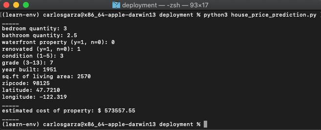

# Housing Prices in King County
Author: Carlos Garza

## Overview
This project contains a regression analysis of the cost of King County real estate. Utilizing the CRISP-DM framework, linear regression models, and statistical techniques, I created and refined a model that describes the cost of real estate in King County in relation to a list of independent variables.

My data, methodology, and derived conclusions are summarized in the body of this document.

## Business Problem
To gain an edge in the industry, a Seattle-based real estate company wants to automate their initial appraisal process. Developing an algorithm to accurately appraise the value of a house without physically inspecting the property can be an invaluable advantage in the fast paced real estate market of a rapidly expanding city. Using county data and multiple linear regression I created a model the company can use to predict real estate values.

## Data
The data for this project comes from property sales in King County in 2014 and 2015. Each sale has data documented for the house at the time of sale.
The data can be found in [kc_house_data.csv](data/kc_house_data.csv) in the data folder, and a description of table columns can be found in [column_names.md](data/column_names.md) in the data folder.

## Methods
This project makes use of multiple linear regression with statsmodels and scikitlearn packages. Additionally, it uses various statistical techniques such as logarithmic transformation and one hot encoding to increase the accuracy of the linear model.

## Results
After data cleaning and multiple reitterations of the model, a final model was created that describes 86% of the variance in the price of real estate in King County.

## Conclusions
The linear model from my notebook can be exported and used in a King County appraisal application.
as an example, this repository includes a deployment folder with a [python script](./deployment/house_price_prediction.py) that can be run from a terminal to predict real estate prices.



### Next Steps
+ Create GUI that takes data and delivers a price estimate.
+ Explore using multiple models for different locations to achieve higher accuracy
+ Modify function to accept an address as an input rather than taking zipcode, latitude, and longitude separately

## For More Information
For more detailed information, please review my full analysis in [my Jupyter Notebook](./master_analysis.ipynb) or my [presentation](./project_presentation.pdf).

For any additional questions, please contact me by email: **carlosjgarza89@gmail.com**

## Repository Structure
```
├── README.md                           <- The top-level README for reviewers of this project
├── master_analysis.ipynb               <- Narrative documentation of analysis in Jupyter notebook
├── master_analysis.pdf                 <- PDF version of master notebook
├── project_presentation.pdf            <- PDF version of project presentation
├── data                                <- Both sourced externally and generated from code
├── images                              <- Both sourced externally and generated from code
├── deployment                          <- Example scripts for a deployment app
└── scratch_files                       <- Notebooks used for scratchwork and unorganized processing
```
